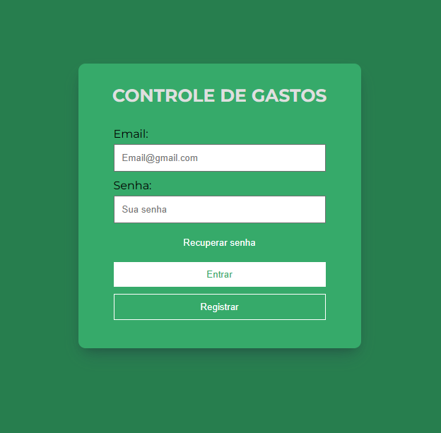

<h1 align="center">Controle de Gastos</h1>

  Projeto feito para

  

## 🚀 Tecnologias

Esse projeto foi desenvolvido com as seguintes tecnologias:

- HTML e CSS
- JavaScript

## Banco Utilizado

- Firebase (Não relacional)

## 💻 Projeto

-   Projeto feito para aprofundamento na ultilização do banco de dados FireBase
